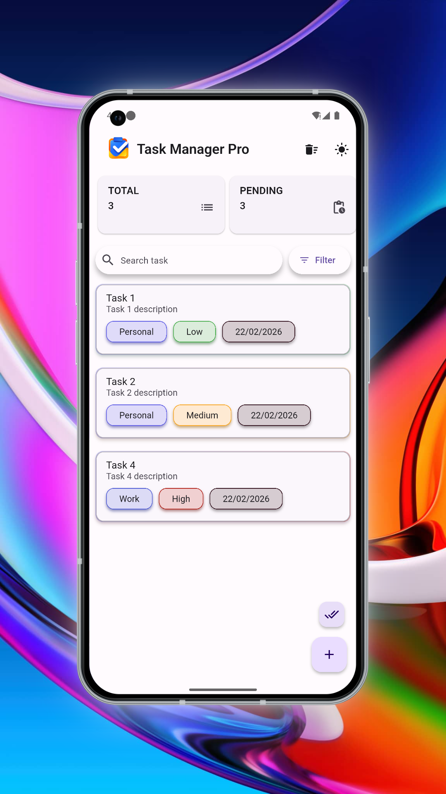
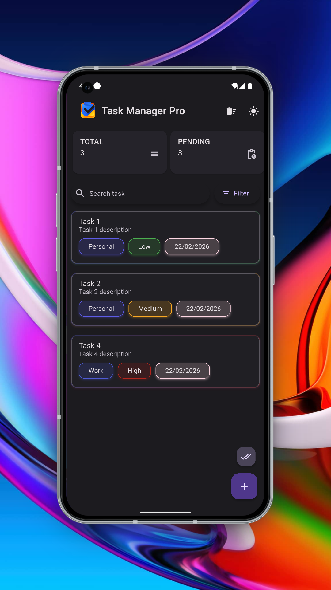
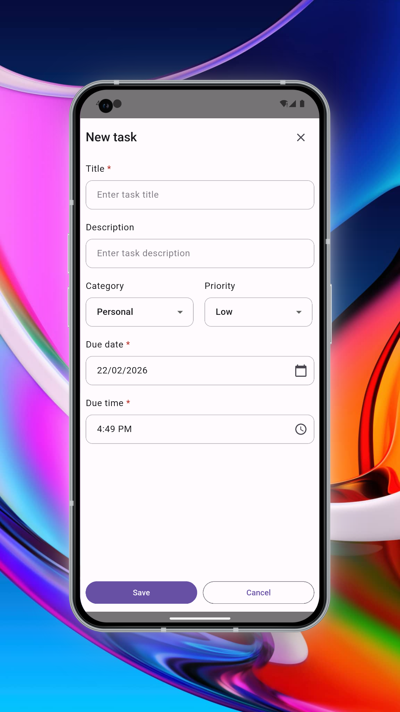
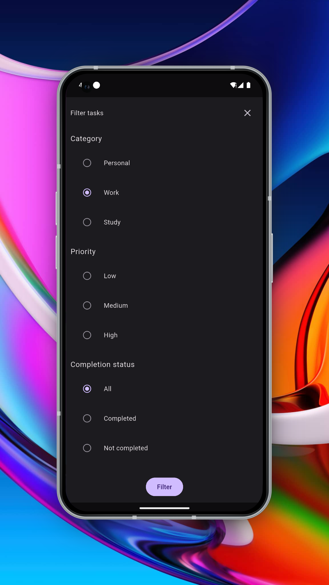
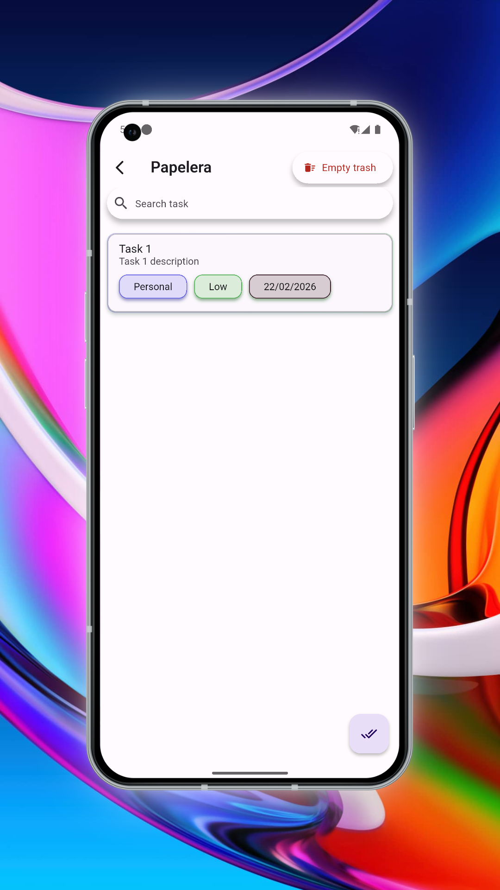

# Task Manager Pro

[](https://flutter.dev)
[](https://dart.dev)
[](https://flutter.dev/docs/deployment)
[](https://github.com/UTOQINGAPP/Arquitectura-CMI.wiki)

**Task Manager Pro** es una aplicación de gestión de tareas para Flutter: clara, rápida y pensada para uso diario. Ofrece lista de tareas con categorías y prioridades, papelera recuperable, recordatorios locales y una interfaz moderna en español e inglés, con modo claro y oscuro.

---

## Qué hace la aplicación

- **Gestionar tareas**: crear, editar, completar y eliminar. Cada tarea tiene título, descripción opcional, categoría, prioridad (Alta/Media/Baja) y fecha y hora límite.
- **Organizar**: categorías y prioridades configurables desde la app; filtros por estado (pendientes/completadas/archivadas), categoría y prioridad; búsqueda por texto.
- **Papelera**: las tareas eliminadas van a una papelera; desde ahí se pueden restaurar o borrar de forma definitiva. Acceso rápido desde la barra principal y opción de vaciar papelera.
- **Recordatorios**: notificaciones locales programadas en la fecha límite de la tarea y recordatorio opcional (por ejemplo 15 minutos antes), con soporte Android e iOS y zona horaria local.
- **Resumen visual**: tarjetas con total de tareas, pendientes, completadas y archivadas; al tocar una tarjeta se aplican filtros rápidos o se refresca la lista.
- **Experiencia de uso**: pull-to-refresh, estados de carga con skeleton, mensajes de error con “reintentar”, estados vacíos con mensajes claros, diálogo “Acerca de” (versión, nombre, legal) y alternancia de tema claro/oscuro desde la barra.

La app es **local por defecto** (base de datos SQLite con Drift): no requiere cuenta ni backend. La estructura del proyecto está preparada para conectar en el futuro un backend o sincronización sin reescribir la interfaz.

---

## Qué la hace diferente

- **Papelera recuperable** integrada en el flujo (no borrado irreversible directo).
- **Notificaciones locales** vinculadas a la fecha límite y a un recordatorio previo, con inicialización correcta de zona horaria y permisos en Android e iOS.
- **Diseño Material 3** con paleta propia (claro/oscuro), tipografía y componentes coherentes en toda la app.
- **Internacionalización real** (es/en) con ARB y l10n de Flutter en textos de UI.
- **Arquitectura CMI** aplicada de forma estricta: capas bien separadas y contratos en `core`, lo que facilita pruebas con fakes y evolución hacia backend o sincronización.

---

## Capturas

Mockups de la interfaz en modo claro y oscuro.

**Lista de tareas — modo claro**



**Lista de tareas — modo oscuro**



**Formulario crear/editar tarea — modo claro**



**Filtros — modo oscuro**



**Papelera — modo oscuro**



---

## Tecnologías y calidad

- **Estado**: Riverpod (hooks_riverpod, riverpod_annotation) con Notifier/AsyncNotifier y código generado; la lógica de estado vive en módulos `logic/` por página o compartidos.
- **Datos**: Drift para SQLite local; tablas para tareas, categorías y prioridades, con índices para filtros y papelera.
- **Navegación**: GoRouter con rutas tipadas (`/tasks`, `/bin`) y generación con go_router_builder.
- **UI**: Material 3, animate_do para transiciones, Skeletonizer para estados de carga.
- **Notificaciones**: flutter_local_notifications con programación por zona horaria (timezone, flutter_timezone).
- **i18n**: flutter_localizations y archivos ARB en `lib/configs/internationalization/`.

El código sigue convenciones claras (nombres en inglés, documentación bilingüe donde aplica), separación entre reglas de dominio (`core/rules`), implementaciones (`core/uses`), infraestructura (`core/infra`) e interfaz (`interface/`), lo que favorece mantenimiento y escalabilidad.

---

## Arquitectura (ventaja técnica)

El proyecto aplica la **Arquitectura CMI** (Capas, Módulos e Integración), documentada en la [wiki oficial](https://github.com/UTOQINGAPP/Arquitectura-CMI.wiki):

- **configs**: constantes e internacionalización.
- **core**: reglas (contratos de datos, servicios y consumidores), implementaciones (adapters, services, origins, consumers) e infra (base de datos Drift, notificaciones).
- **interface**: app, router, páginas (tasks, bin), componentes compartidos y lógica de UI (Riverpod).

El acceso entre estructuras se hace a través de los enrutadores o puntos de entrada definidos; la UI no conoce detalles de persistencia ni de notificaciones, solo de contratos y lógica expuesta. Esto permite testear con fakes (servicios de tareas, categorías, prioridades, notificaciones) y prepara la integración futura con API REST o sincronización sin reestructurar la app.

---

## Decisiones técnicas breves

| Decisión                              | Motivo                                                                                                                                       |
| ------------------------------------- | -------------------------------------------------------------------------------------------------------------------------------------------- |
| **Riverpod (Notifier/AsyncNotifier)** | Estado predecible, fácil de testear e inyectar dependencias (fakes en tests).                                                                |
| **Drift**                             | Tipado fuerte, migraciones claras e índices para filtros y papelera.                                                                         |
| **GoRouter con rutas tipadas**        | Navegación declarativa y type-safe; `/tasks` y `/bin` como rutas explícitas.                                                                 |
| **Notificaciones en capa de infra**   | Inicialización (permisos, timezone) y programación aisladas; la lógica de negocio solo usa un contrato (consumer).                           |
| **Contratos en core/rules**           | Servicios y consumidores definidos por interfaces; la UI y los tests dependen de abstracciones, no de Drift ni del plugin de notificaciones. |
| **l10n con ARB**                      | Un solo lugar para textos (en/es), soporte nativo de Flutter y escalable a más idiomas.                                                      |

---

## Tests

Hay tests unitarios para la lógica de tareas (lista, crear, editar, eliminar, estado, categoría, prioridad) en `test/container/`, usando un contenedor de pruebas con **fakes** para los servicios (tareas, categorías, prioridades, notificaciones). Helpers y datos de prueba están en `test/helper/` y `test/fakes/`.

```bash
flutter test
```

---

## Cómo ejecutar el proyecto

Requisitos: Flutter (SDK ^3.11.0) y Dart ^3.11.0.

```bash
git clone <url-del-repositorio>
cd task_manager_pro

flutter pub get
dart run build_runner build --delete-conflicting-outputs

flutter run
```

Para regenerar localizaciones tras cambiar archivos `.arb`:

```bash
flutter gen-l10n
```

---

## Escalabilidad futura

La aplicación está preparada para:

- Conectar un **backend REST** (contratos en `core/rules`, implementaciones en `core/uses`).
- Añadir **sincronización** multi-dispositivo o en tiempo real.
- Introducir **autenticación** por usuario.

Sin necesidad de reescribir la capa de presentación, manteniendo la misma arquitectura y separación de responsabilidades.

---

## Estado del proyecto

- **Versión:** 1.0.0+1
- **Estado:** En desarrollo activo.
- Funcionalidades actuales: CRUD de tareas, categorías y prioridades; papelera con restaurar/eliminar; filtros y búsqueda; resumen por estado; notificaciones locales (fecha límite y recordatorio); tema claro/oscuro; internacionalización (es/en); tests unitarios de lógica con fakes.

---

## Autor

**Diego Moreano Merino**  
Desarrollador Flutter · Arquitectura CMI · Enfoque en producto y calidad de código
